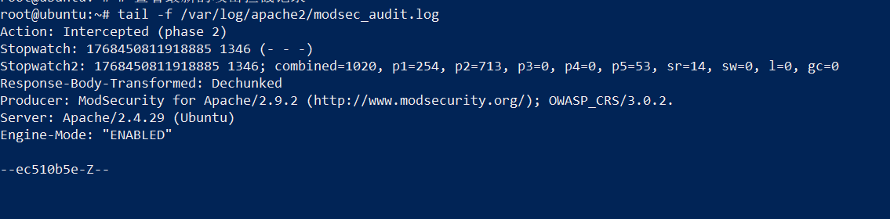

# -ModSecurity-Web-WAF-
在 Ubuntu 18.04 上部署 Apache + ModSecurity，并利用 OWASP CRS 防御 SQL 注入攻击 。
# 实验报告：基于 ModSecurity (WAF) 的 Web 攻击防护实战

## 1. 实验目标 🎯
* 在 Ubuntu 18.04 上部署基础 Web 环境（Apache + PHP）。
* 安装并配置 ModSecurity (WAF) 引擎 [cite: 4, 20]。
* 使用 OWASP 核心规则集 (CRS) 拦截 SQL 注入等常见 Web 攻击 。
* 通过 Wireshark 抓包分析攻击请求与拦截响应 。


## 2. 网络拓扑 🌐
[cite_start]实验环境基于 EVE-NG 搭建，包含攻击者、防火墙网关及目标服务器 [cite: 10]。

 


| 节点名称 | 角色 | IP 地址 |
| :--- | :--- | :--- |
| **Kali** | 攻击机 | 192.168.113.131  |
| **Ubuntu** | Web 服务器 | 192.168.113.132  |
| **ASAv** | 安全网关 | 202.100.1.254 (Outside) / 192.168.1.254 (Inside) |

---

## 3. 实验过程 🛠️

### A. Web 环境与 WAF 安装
首先在 Ubuntu 上安装 Apache 和 PHP 环境，并加载安全模块 ：
```bash
# 安装 Apache, PHP 及 ModSecurity 模块
apt install apache2 php7.2 libapache2-mod-php7.2 libapache2-mod-security2 -y 
# 启用安全模块
a2enmod security2 
systemctl restart apache2 

```

### B. WAF 拦截配置

将 WAF 从“仅检测”模式切换为“拦截”模式以实现主动防御 ：

```bash
# 初始化配置文件
cp /etc/modsecurity/modsecurity.conf-recommended /etc/modsecurity/modsecurity.conf 
# 修改引擎状态为 On
sed -i 's/SecRuleEngine DetectionOnly/SecRuleEngine On/' /etc/modsecurity/modsecurity.conf 

```

## 4. 攻击测试与结果分析 ⚖️

### 场景模拟

在 Kali 上使用 `curl` 模拟 SQL 注入攻击 ：

```bash
# 攻击载荷：id=1' OR '1'='1
curl -I "[http://192.168.113.132/login.php?id=1%27%20OR%20%271%27=%271](http://192.168.113.132/login.php?id=1%27%20OR%20%271%27=%271)" 

```

### 防护效果验证

1. **日志确认**：查看 `/var/log/apache2/modsec_audit.log`，确认 WAF 已命中规则并执行 `Intercepted` 操作 。
 


2. **流量分析**：Wireshark 抓包显示服务器直接返回了 **403 Forbidden**，证明恶意请求被成功阻断 。
 


---

## 5. 经验总结 (Troubleshooting) 📝

在实验中，通过不断排查解决了以下关键问题 ：

| 遇到的问题 | 根本原因分析 | 解决方案 |
| --- | --- | --- |
| **PHP 源代码泄露** | Nginx 未配置 FastCGI 处理 PHP 文件 。

 | 切换到对 ModSecurity 支持更原生的 Apache 环境 。

 |
| **HTTP 400 错误** | 攻击载荷中包含单引号 `'` 等字符，未进行编码 。

 | 使用 URL 编码（%27）转义攻击载荷 。

 |
| **Wireshark 无流量** | 监听了错误的网口（e0） 。

 | 重新在实际承载流量的接口开启捕获 。

 |

---

## 6. 结论

通过本实验，成功验证了 ModSecurity 配合 OWASP CRS 在应对应用层 SQL 注入攻击时的有效性 。同时，实验强调了在复杂网络环境下（如经过 ASAv 防火墙）进行流量分析和路径定位的重要性 。

